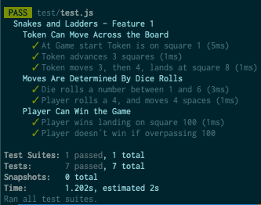

# Snakes and Ladders Kata, Feature 1

Implementation in node.js of the [Snakes and Ladders Kata](http://agilekatas.co.uk/katas/SnakesAndLadders-Kata)

## Approach
The kata is implemented using TDD approach. Tests for each requested functions are developed and evaluated. Source code is refactored until meets all tests criteria.

## Decisions
Kata implemented in ES5 with node.js to avoid using any translators. Node.js offers portability, easy integration of testing modules, and easy project escalability if needed at any future point. 

Tests are implemented with Jest. Jest is very simple and can be used with barely no configuration out of the box. Jest runs Tests in parallel thus saving time. Tests results are additionally very visually. Other considered testing frameworks were Jasmine and Mocha, but those require some more configuration compared to Jest. 

## Envision
Solution is implemented with the function Player that acts as a class. This allows to expand its methods with newer features, while already defined methods will be consistent and will pass the tests. The Player function is initiated for each player in the game and holds the defined capabilities to play the game: position, winning-state, move, roll the die

## Install
The projects runs on `Node.js`. To run it you need to have installed [git](https://git-scm.com/book/en/v2/Getting-Started-Installing-Git) and [nodejs.org](https://nodejs.org/en/download/)

Open terminal and change working directory to where you want to install it. Run:

```
git clone https://github.com/solracid/snakes_and_ladders_kata.git
```

```
cd snakes_and_ladders_kata
```

```
npm install
```

Once installed, check the game's features are working properly:
```
npm run test
```

Output should look like this one:



